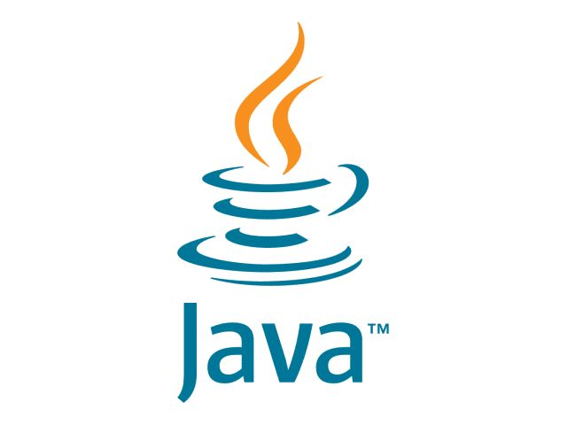
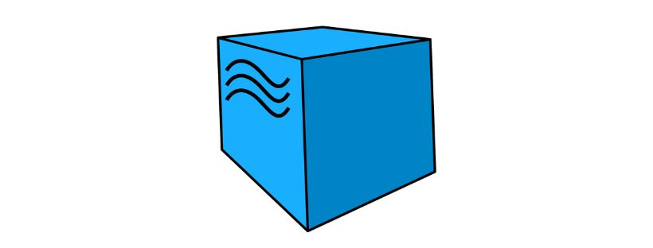
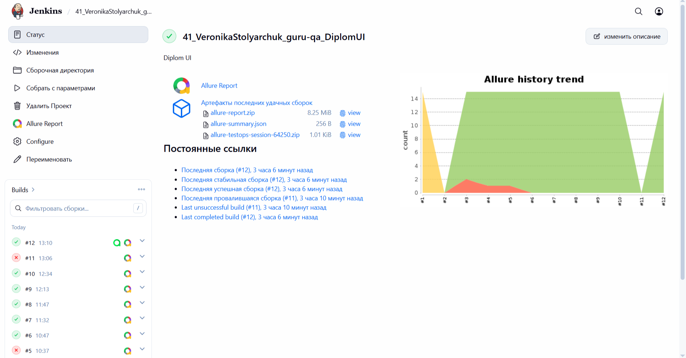

# Автоматизация тестирования сайта [Русский букет](https://rus-buket.ru)

<p align="center">
  
</p>

## Про проект
В рамках проекта реализуется тестирование веб‑сайта [Русский букет](https://rus-buket.ru) с применением комбинации автоматизированных UI‑тестов и ручных проверок. Проект базируется на современном технологическом стеке, предусматривает интеграцию CI/CD и организацию системы формирования отчётности.

## Технологический стек

<p align="center">
<a href="https://www.java.com/"></a>
<a href="https://www.jetbrains.com/idea/"></a>
<a href="https://gradle.org/"></a>
<a href="https://junit.org/junit5/"></a>
<a href="https://github.com/"></a>
<a href="https://selenide.org/"></a>
<a href="https://aerokube.com/selenoid/"></a>
<a href="https://github.com/allure-framework/allure2"></a>
<a href="https://qameta.io/"></a>
<a href="https://www.jenkins.io/"></a>
<a href="https://www.atlassian.com/ru/software/jira"></a>
</p>

Автотесты реализованы на Java с применением Selenide и паттерна Page Object. Сборка проекта — Gradle, запуск тестов — на базе JUnit 5. Для сокращения шаблонного кода используются аннотации Lombok.
CI/CD-пайплайн развёрнут в Jenkins; результаты прогонов визуализируются в Allure Report, а критические статусы автоматически отправляются в Telegram. Предусмотрены интеграции с Allure TestOps и Jira для управления дефектами и тестовой документацией.

## Автотесты, реализованные в проекте
###  Smoke-проверки (критичный функционал)
Эти тесты запускаются при каждом CI‑прогоне и быстро подтверждают работоспособность основных сценариев:
- Открытие главной страницы и наличие элементов меню.
- Отображение каталога и основных разделов.
- Поиск товаров по популярным запросам («Лилии», «Альстромерии», «Ирисы»).
- Добавление товара в корзину и проверка наличия в корзине.
- Оформление заказа в 1 клик (быстрый заказ).

###  Функциональные проверки (детализация и валидация)
Более узкие сценарии, проверяющие корректность поведения и валидацию данных:
- Отображение логотипа на главной странице.
- Переключение языка интерфейса и проверка хедера.
- Выбор города доставки и отображение выбранного города.
- Удаление товара из корзины.
- Валидация полей: некорректный номер телефона в форме обратной связи, пустой пароль при авторизации.

## Запуск автотестов:

### Локальный запуск:
```
gradle clean test
```
### Удалённый запуск через Jenkins:
```
clean test
-Dbrowser=$BROWSER
-DbrowserVersion=$BROWSER_VERSION
-DbrowserSize=$BROWSER_SIZE
-DbaseUrl=$BASE_URL
-Dheadless=$HEADLESS
```

<a id="сборка-в-jenkins"></a>

##  [Сборка в Jenkins](https://jenkins.qa.guru/job/41_VeronikaStolyarchuk_guru-qa_DiplomUI/)

Для запуска сборки необходимо перейти в раздел <code>Собрать с параметрами</code> и нажать кнопку <code>Собрать</code>.
<p align="center">

</p>
После выполнения сборки, в блоке <code>История сборок</code> напротив номера сборки появятся значки <code>Allure Report</code> и <code>Allure TestOps</code>, при клике на которые откроется страница с сформированным html-отчетом и тестовой документацией соответственно.
